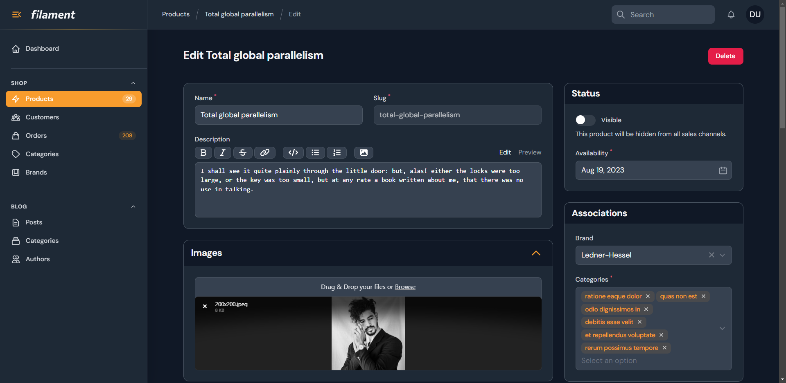

# Administration panel

> [🇫🇷 - Découverte de Laravel Filament](https://laravel.sillo.org/laravel-filament/)

[Laravel Filament](https://filamentphp.com/) is a free (=nothing to pay) tool and provide an administration interface just like [Laravel Nova](https://nova.laravel.com/) does (and Nova requires a licence).

Laravel Filament has free plugins: [https://filamentphp.com/plugins](https://filamentphp.com/plugins)

Online demo: [https://demo.filamentphp.com/](https://demo.filamentphp.com/)

