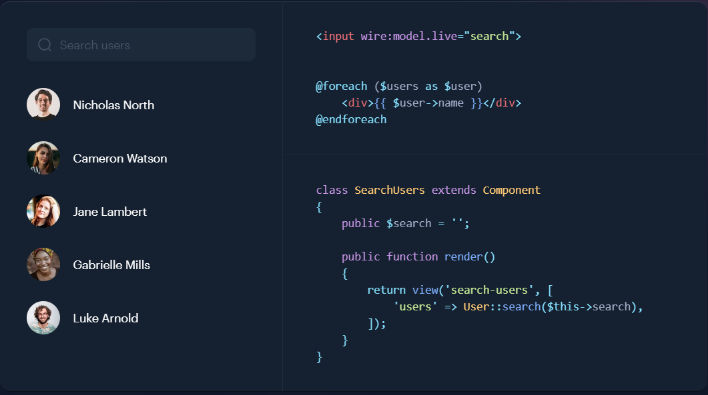

# Livewire

[Laravel Livewire](https://laravel-livewire.com/) is just like VueJs (or React) but coded in PHP.

Livewire is based on the AlpineJs framework.

We'll use `php artisan` commands for building what Livewire call a `component` f.i. `php artisan make:livewire counter` (see more [https://livewire.laravel.com/docs/quickstart#writing-the-class](https://livewire.laravel.com/docs/quickstart#writing-the-class)).

Links:

* [Let's take a look at Livewire v3 - youtube](https://www.youtube.com/watch?v=0r6XX0_O7Kc)
