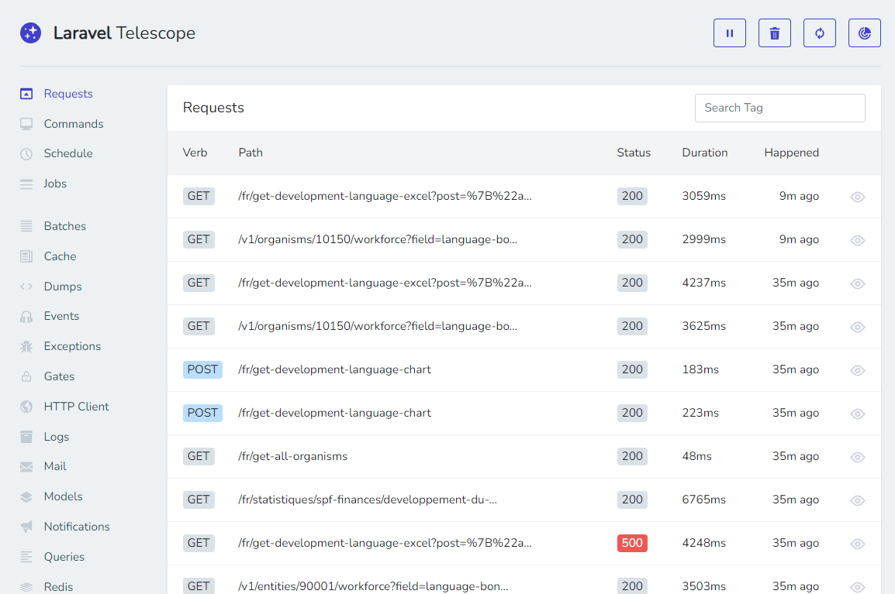

<!-- This file has been generated by the concat.sh script. -->
<!-- Don't modify this file manually (you'll loose your changes) -->
<!-- but run the tool once more -->
<!-- Last refresh date: Monday, July 24, 2023, 22:13:34 -->

# Laravel Tips & Tricks

> Collection of Laravel tips and tricks, including some files like artisan command

You'll find here some tips & tricks, artisan commands, batch files, ... to make easier to work with Laravel.

<!-- table-of-contents - start -->
* [Administration panel](#administration-panel)
* [Artisan tips](#artisan-tips)
  * [Clear sessions](#clear-sessions)
    * [Installation](#installation)
    * [Use](#use)
  * [Test database connection](#test-database-connection)
    * [Installation](#installation)
    * [Use](#use)
  * [Laravel Telescope](#laravel-telescope)
* [Eloquent tips](#eloquent-tips)
  * [Disable Lazy Loading](#disable-lazy-loading) 
  * [Enabling Strict Mode for Eloquent models](#enabling-strict-mode-for-eloquent-models)
* [Log in using GitHub, Facebook, ... i.e. with oAuth](#log-in-using-github-facebook-i-e-with-oauth)
* [Redis - PHP cache management service](#redis-php-cache-management-service)<!-- table-of-contents - end -->

## Administration panel

> [🇫🇷 - Découverte de Laravel Filament](https://laravel.sillo.org/laravel-filament/)

[Laravel Filament](https://filamentphp.com/) is a free (=nothing to pay) tool and provide an administration interface just like [Laravel Nova](https://nova.laravel.com/) does (and Nova requires a licence).

Laravel Filament has free plugins: [https://filamentphp.com/plugins](https://filamentphp.com/plugins)

Online demo: [https://demo.filamentphp.com/](https://demo.filamentphp.com/)

## Artisan tips

### Clear sessions

Custom artisan command for clearing all sessions (both in database and on the filesystem).

#### Installation

Copy [ClearSessions.php](ClearSessions.php) under your `app/console/commands`.

#### Use

From your prompt, run `php artisan session:clear`.

### Test database connection

Custom artisan command for quickly check

#### Installation

Copy [testDbConnection.php](testDbConnection.php) under your `app/console/commands`.

#### Use

From your prompt, run `php artisan db:test-connection`.

### Laravel Telescope

> [Laravel Telescope](https://laravel.com/docs/master/telescope)

By installing [Laravel Telescope](https://laravel.com/docs/master/telescope), we can get realtime informations about cache, logs, querys and models, exceptions, ... and this will help a lot to understand how the application is working and what's is running.

For an Eloquent model f.i. we'll retrieve in Telescope (the default URL is `http://your_site/telescope`), we'll get the raw SQL so it's easy to copy/paste and run directly in pgadmin f.i.

For Redis cache f.i., we'll see keys and if they were retrieve (`hits`) or created (`set`).

Laravel Telescope can also be installed on a test serveur to see what the user is doing and get the full context on each request so when an exception was fired, we can retrieve it in the log, the exception message, the post data, the used URL and much more.

## Eloquent tips

### Disable Lazy Loading 

> [🇬🇧 Disable Lazy Loading](https://laracasts.com/series/jeffreys-larabits/episodes/3)

Lazy loading is associated to the **N+1** well-known Laravel features i.e. if we don't pay attention, by running `$post->all()` (getting all blog posts) then by showing their authors `$post->author->email` we can have a loop: for each single blog post, Laravel will run a new query to get the author.

If there are 100 blog posts, we'll run 101 queries. And this silently since we will not see it (unless we're using debug tools like [Laravel Telescope](https://laravel.com/docs/master/telescope)).

So, the idea is to prohibit lazy loading and throw a fatal error during development so we can immediately see the problem and solve it.

### Enabling Strict Mode for Eloquent models

> [🇬🇧 Laravel's Strict Mode](https://laracasts.com/series/jeffreys-larabits/episodes/29)

Laravel will allow to write `$user->emal` (instead of `$user->email` i.e. with a typo). He'll think that `email` is a valid attribute even if, when displaying it's value, we'll get null or an empty string.

We can force Laravel to be strict and refuse access to inexisting attributes using the **Strict mode**  

## Log in using GitHub, Facebook, ... i.e. with oAuth

> [🇬🇧 From Zero to "Log In With GitHub" in Ten Minutes](https://laracasts.com/series/jeffreys-larabits/episodes/25)

Using [Laravel Breeze](https://laravel.com/docs/10.x/starter-kits#laravel-breeze) and [Laravel Socialite](https://laravel.com/docs/10.x/socialite) it can be quite easy to offer a `Register with` / `Log in with` feature.

The episode on Laracast is showing in less than 10 minutes how to create an authentication process using GitHub and retrieve back the GitHub id, name, email and token of the visitor. Then create the user in our database so, next time, the user can just click on `Log in with GitHub` button.

What's is nice then, it's the `createOrUpdate` method based on the GitHub id i.e. if the user update his GitHub profile, changes will be made in our application too.

Other links:

* [🇫🇷 - Laravel Socialite : Authentification OAuth avec Google, Facebook et Github (Social login)](https://www.akilischool.com/cours/laravel-socialite-connexion-inscription-avec-google-facebook-github-linkedin-social-login)

## Redis - PHP cache management service

> [🇬🇧 Trending Articles with Sorted Sets](https://laracasts.com/series/learn-laravel-and-redis-through-examples/episodes/3)
> [🇬🇧 How to Structure Your Caching Layer](https://laracasts.com/series/learn-laravel-and-redis-through-examples/episodes/6)

The two videos here above show techniques on using Redis for, f.i., storing the most popular blog posts in redis. No database connection required and this is very fast.

Just store f.i. the url or the blog article id in Redis and use the `Incr` (increment) method to increment the number of view by one. Really easy to do and to retrieve.
